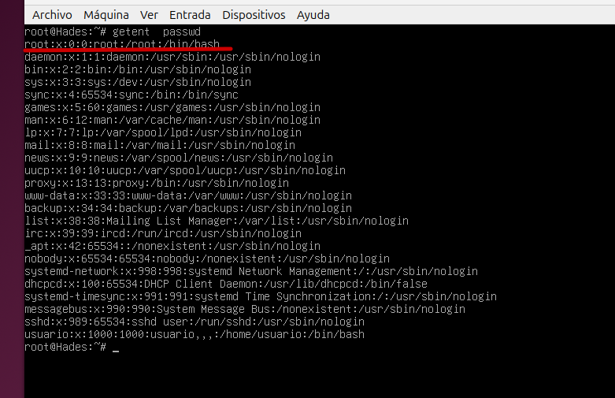
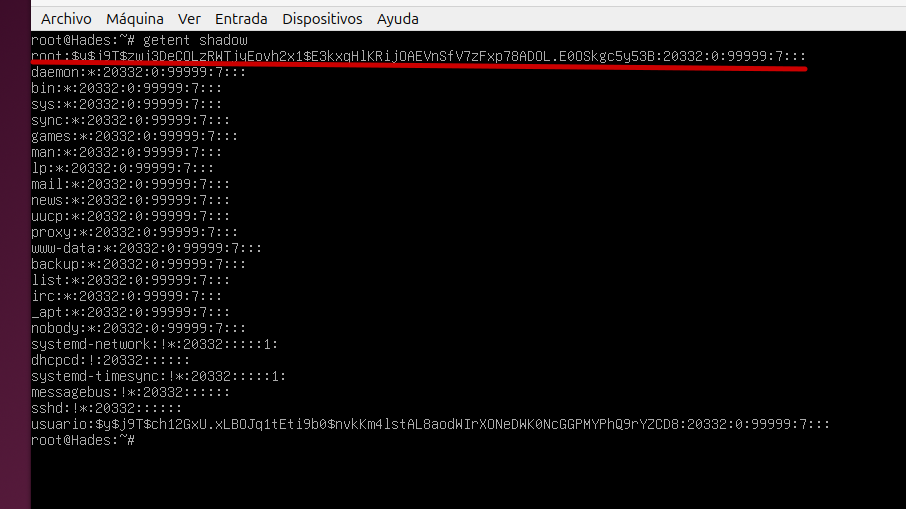
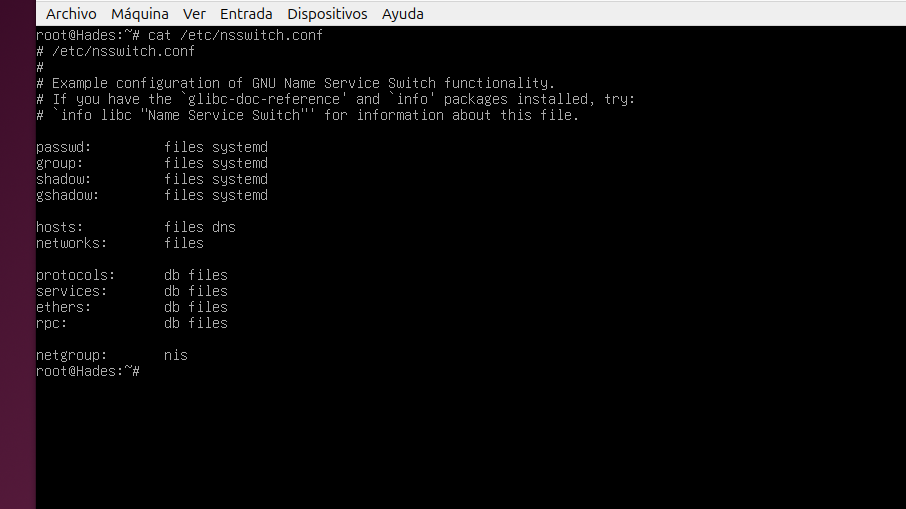

# 9. Usuarios Y Grupos

cat /etc/passwd : getent passwd

cat /etc/shadow : getent shadow

cat /etc/group : getent group

cat /etc/gshadow : getent gshadow

cat /etc/nsswitch.conf

files : Busca en /etc/passwd

systemd : Busca en el sistema

